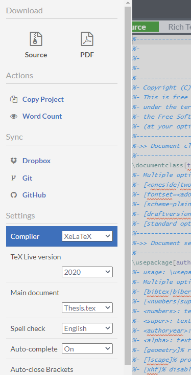
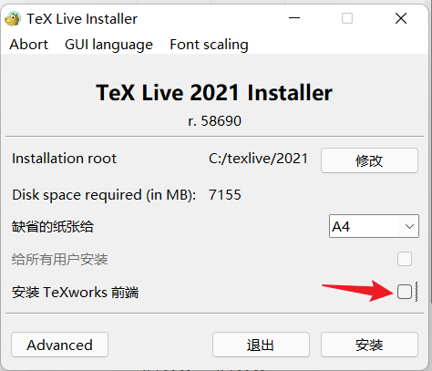
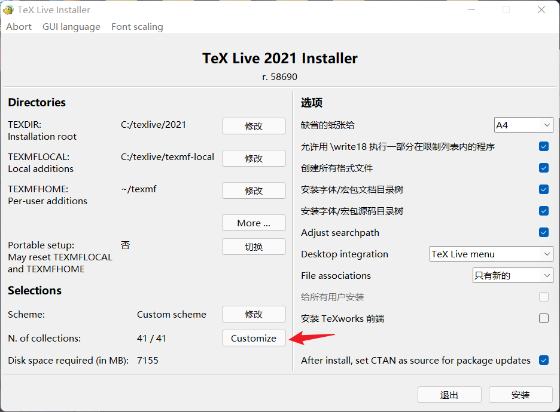
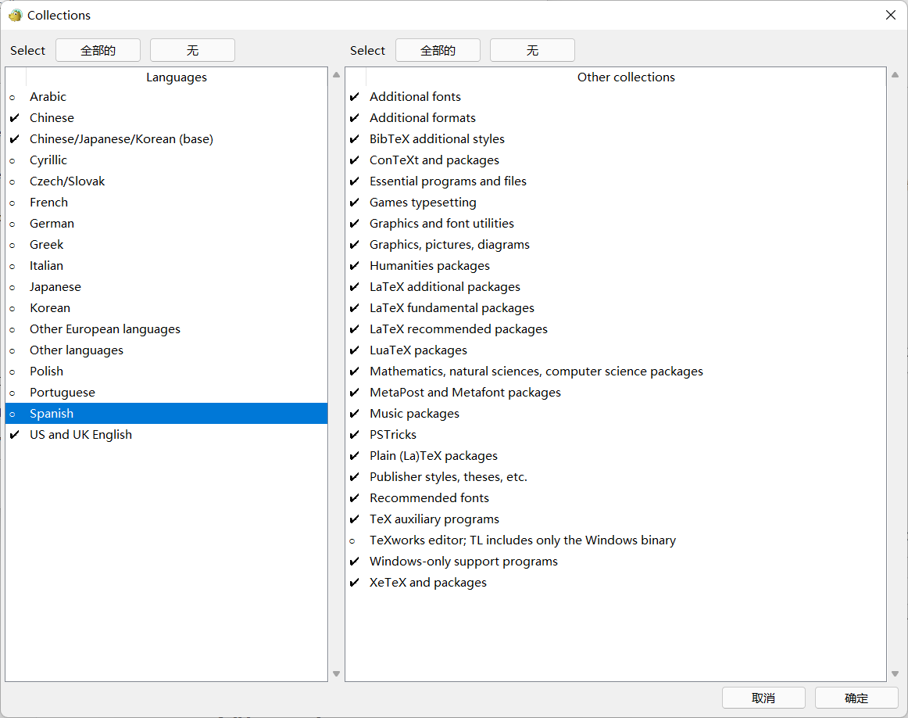
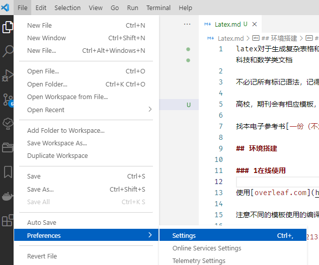
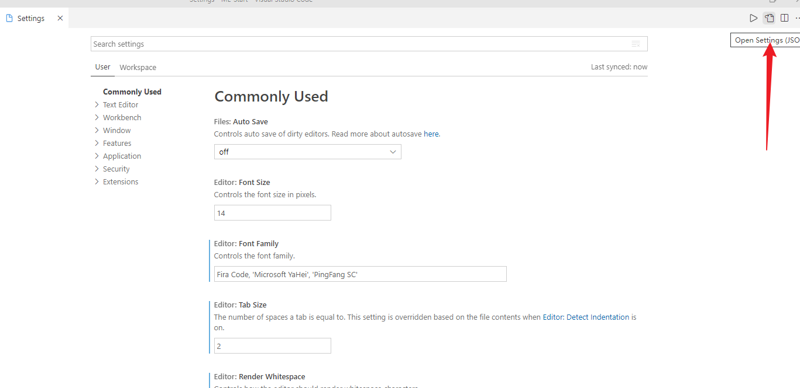

latex对于生成复杂表格和[数学公式](https://baike.baidu.com/item/%E6%95%B0%E5%AD%A6%E5%85%AC%E5%BC%8F/10349953)，这一点表现得尤为突出。因此它非常适用于生成高印刷质量的科技和数学类文档

不必记所有标记语法，记得常用的就行，可以用带提示的编辑器

高校，期刊会有相应模板，改模板即可

找本电子参考书[一份（不太）简短的 LATEX 2ε 介绍](./PDF/lshort-zh-cn.pdf)

## 环境搭建

### 1. 在线使用

使用[overleaf.com](https://overleaf.com) 找到对应的模板，在线写，在线编译

注意不同的模板使用的编译器可能不同，看要求修改



### 2. 本地使用

overleaf很香，建议不要折腾 **跳过这部分**

如果要经常使用，建议本地安装latex编译系统 texlive ，和文本编辑器vscode 

使用vscode写，texlive编译

#### 1.安装texlive

到清华大学开源软件镜像站的[texlive页](https://mirrors.tuna.tsinghua.edu.cn/CTAN/systems/texlive/Images/)，下载最新的texlive.ios，安装 



不建议使用texworks就不安装这个，点击`Advanced`取消不需要安装的宏包





把非中英文的语言包取消能省1G的空间，也可以不取消

4G多的环境，安装时间有点长，patient

**重点**，安装完texlive后，因为安装时软件只添加了当前用户的环境变量，vscode编译时使用的是系统的环境变量，所以需要手动打开环境变量，在系统环境变量`PATH`中添加安装路径

#### 2.安装vscode

[vscode官网](https://code.visualstudio.com/)下载安装 

##### 配置vscode

##### 1.安装对应插件

打开扩展商店 ，搜索并安装`latex workshop`

##### 2.很重要，配置`setting`文件



然后右上角点击打开配置文件



将以下代码放入设置区：

```json
"latex-workshop.latex.tools": [
    {
        // 编译工具和命令
        "name": "xelatex",
        "command": "xelatex",
        "args": [
            "-synctex=1",
            "-interaction=nonstopmode",
            "-file-line-error",
            "-pdf",
            "%DOCFILE%"
        ]
    },
    {
        "name": "pdflatex",
        "command": "pdflatex",
        "args": [
            "-synctex=1",
            "-interaction=nonstopmode",
            "-file-line-error",
            "%DOCFILE%"
        ]
    },
    {
        "name": "bibtex",
        "command": "bibtex",
        "args": [
            "%DOCFILE%"
        ]
    }
],
"latex-workshop.latex.recipes": [
    {
        "name": "xelatex",
        "tools": [
            "xelatex"
        ],
    },
    {
        "name": "pdflatex",
        "tools": [
            "pdflatex"
        ]
    },
    {
        "name": "xe->bib->xe->xe",
        "tools": [
            "xelatex",
            "bibtex",
            "xelatex",
            "xelatex"
        ]
    },
    {
        "name": "pdf->bib->pdf->pdf",
        "tools": [
            "pdflatex",
            "bibtex",
            "pdflatex",
            "pdflatex"
        ]
    }
],
```

当前配置完可能还有点问题，待更新解决

>参考：
>
>[Visual Studio Code 编辑 LaTex 入门 （一）](https://www.jianshu.com/p/538856b3e5c0)
>
>[使用VSCode编写LaTeX](https://zhuanlan.zhihu.com/p/38178015)
>
>[配置 Visual Studio Code 作为 LaTeX 的编辑器。](https://github.com/EthanDeng/vscode-latex)

## 使用

建议先不本地搭建环境，先使用overleaf在线使用

[一份其实很短的 LaTeX 入门文档](https://liam.page/2014/09/08/latex-introduction/)

先新建一个项目，然后跟着上面这篇文章简单了解下基本的讲法

>一些学校的论文模板
>
>[兰州大学本科生2021（学士学位）LaTeX模板](https://github.com/yuhlzu/LZUThesis2020)
>
>[上海交通大学论文模板](https://github.com/sjtug/SJTUThesis)
>
>[国科大学位论文 LaTeX 模板](https://github.com/mohuangrui/ucasthesis)
>
>[西北工业大学本科毕业设计论文](https://github.com/polossk/LaTeX-Template-For-NPU-Thesis)
>
>[LaTeX Thesis Template for Tsinghua University](https://github.com/tuna/thuthesis)

### 以兰大模板示例在overleaf上使用模板

#### 1.下载项目的zip包到本地

2.在overleaf中点击`new project`把下载的zip包上传到新项目

3.在项目左上角`menu`，修改编译器为xelatex

