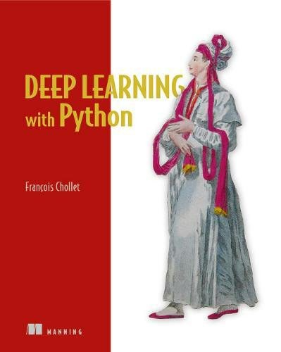

- [ 了解](#head1)
	- [ 人工智能](#head2)
	- [ 机器学习](#head3)
	- [ 深度学习](#head4)
- [ 学习路线](#head5)
- [ 数学](#head6)
	- [ 线代](#head7)
- [ python基础](#head8)
	- [ mosh大神](#head9)
	- [Python 数据结构与算法分析](#head10)
	- [python 编程从入门到实践](#head11)
- [ python数据分析](#head12)
- [ 课程类](#head13)
	- [ 吴恩达机器学习](#head14)
	- [李宏毅 2021 春机器学习课程](#head15)
- [机器学习实战 ](#head16)
	- [大神 up](#head17)
	- [晓唦 up](#head18)
- [ 机器学习原理](#head19)
	- [ 西瓜书](#head20)
	- [ 南瓜书](#head21)
	- [ 统计学习方法](#head22)
	- [精通特征工程 ](#head23)
- [ 深度学习](#head24)
	- [ 吴恩达深度学习](#head25)
	- [ 深度学习入门](#head26)
	- [ 深度学习进阶](#head27)
		- [python 深度学习(这本书比深度学习入门难一点)](#head28)
		- [deep learning 花书 难 与西瓜书类似理论多](#head29)
		项目计划

:white_check_mark:python

:white_check_mark:机器学习

⬜深度学习

⬜文献阅读

##  了解

###  人工智能

当前的人工智能本质是统计学，给一堆数据，程序从数据中找到规律，然后用这个程序解决问题。所以现在的人工智能只是根据以往数据解决问题，只是能力，不是智能。就是统计数据，分析数据。

###  机器学习

传统编程是解决特定任务、硬编码的软件程序，人为定义好规则

机器学习是机器学习是用大量的数据来“训练”，通过各种算法从数据中学习如何完成任务

###  深度学习

最初的深度学习是利用深度神经网络来解决特征表达的一种学习过程，深度神经网络本身并不是一个全新的概念，可大致理解为包含多个隐含层的神经网络结构。为了提高深层神经网络的训练效果，人们对神经元的连接方法和激活函数等方面做出相应的调整。其实有不少想法早年间也曾有过，但由于当时训练数据量不足、计算能力落后，因此最终的效果不尽如人意。

深度学习摧枯拉朽般地实现了各种任务，使得似乎所有的机器辅助功能都变为可能。无人驾驶汽车，预防性医疗保健，甚至是更好的电影推荐，都近在眼前，或者即将实现。

然而作为目前最热的机器学习方法，但并不意味着是机器学习的终点。还是有一些问题的

##  学习路线

数学作为前置知识，没事可以看看，不建议花大量时间

python基础要有，机器学习原理和机器学习实战并行学习

##  数学

可以有时间翻翻科普书[数学之美](PDF/数学之美.pdf)

不建议一开始非要打好所有的数学基础，学习过程中有什么不会再单独看 [机器学习的数学基础](https://github.com/fengdu78/Data-Science-Notes/tree/master/0.math/0.basic)

###  线代

[Introduction to Linear Algebra](PDF/IntroductiontoLinearAlgebra5th2016.pdf) - Gilbert Strange 更加面向实际应用，难度适中，比较注重从实际问题中培养数学直觉，**比较适合工程学科学生使用**

机器学习，深度学习中的线性代数基础，为之后看核函数做准备

https://www.bilibili.com/video/BV1NE411n73i可以跟着视频一起看

##  python基础

###  mosh大神

[python从入门到精通](https://www.bilibili.com/video/BV1ng4y1i7Uk)

### Python 数据结构与算法分析

### python 编程从入门到实践

##  python数据分析

[利用Python进行数据分析·第2版](https://github.com/iamseancheney/python_for_data_analysis_2nd_chinese_version)

**晓唦** up  https://www.bilibili.com/video/BV1cA411v7VG、

**致敬大神**up  [利用Python进行数据分析第一弹-Python进阶](https://www.bilibili.com/video/BV1z4411N7iv)

##  课程类

###  吴恩达机器学习

https://www.bilibili.com/video/BV164411S78V

代码https://github.com/fengdu78/Coursera-ML-AndrewNg-Notes 在这个项目上的 code 中

课件资料http://www.ai-start.com/ml2014/

### 李宏毅 2021 春机器学习课程

https://www.bilibili.com/video/BV1Wv411h7kN

课件及资料https://github.com/Fafa-DL/Lhy_Machine_Learning

## 机器学习实战 

[机器学习实战 基于Scikit-Learn和TensorFlow](PDF/《机器学习实战：基于Scikit-Learn、Keras和TensorFlow第2版》中文PDF.pdf)

作为==重==点

第一版是灰色的，第二版是彩色壁虎

原作者代码https://github.com/ageron/handson-ml

##### 大神 up

https://www.bilibili.com/video/BV1iJ411k7Gg

##### 晓唦 up

https://www.bilibili.com/video/BV1iE411y7BD

https://github.com/shazhongcheng/machine_learing_study

**菜菜up**

https://www.bilibili.com/video/BV1vJ41187hk

##  机器学习原理

###  西瓜书

**大神 up** https://www.bilibili.com/video/BV17J411C7zZ

###  南瓜书

对西瓜书里比较难理解的公式加以解析，以及对部分公式补充具体的推导细节

南瓜书https://github.com/datawhalechina/pumpkin-book

###  统计学习方法

代码实现https://mp.weixin.qq.com/s/71w0IN3gAYWxrKVM_lcYrQ

### 精通特征工程 

看自己吧

![精通特征工程[pdf txt epub azw3 mobi]](images/readme/27855464-1_w_10-16316718020617.jpg)

##  深度学习

###  吴恩达深度学习

http://www.ai-start.com/

###  深度学习入门

这两个月只用完成这个即可

###  深度学习进阶

#### python 深度学习(这本书比深度学习入门难一点)

#### deep learning 花书 难 与西瓜书类似理论多
